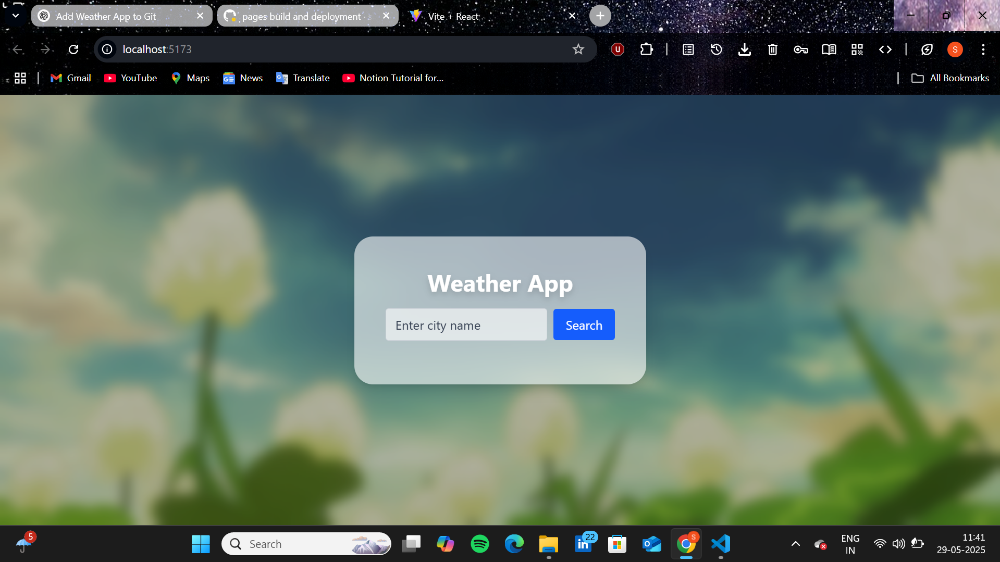

# React + Vite

This template provides a minimal setup to get React working in Vite with HMR and some ESLint rules.

Currently, two official plugins are available:

- [@vitejs/plugin-react](https://github.com/vitejs/vite-plugin-react/blob/main/packages/plugin-react) uses [Babel](https://babeljs.io/) for Fast Refresh
- [@vitejs/plugin-react-swc](https://github.com/vitejs/vite-plugin-react/blob/main/packages/plugin-react-swc) uses [SWC](https://swc.rs/) for Fast Refresh

## Expanding the ESLint configuration

If you are developing a production application, we recommend using TypeScript with type-aware lint rules enabled. Check out the [TS template](https://github.com/vitejs/vite/tree/main/packages/create-vite/template-react-ts) for information on how to integrate TypeScript and [`typescript-eslint`](https://typescript-eslint.io) in your project.


# 🌿 Ghibli Weather App

A simple, cozy weather app inspired by Studio Ghibli’s magical aesthetics and Pinterest’s clean, visual style.  
Get your local weather with a touch of warmth and animation!

---


.png)
.png)
.png)


---

## Features ✨

- Soft, pastel Ghibli-themed design  
- Displays weather based on your current location or searched city  
- Responsive layout inspired by Pinterest cards  
- Animated GIF elements to bring the weather to life  
- Easy and calming user experience

---

## Live Demo 🚀

Check out the live version here:  
[https://sharmila1320.github.io/ghibli-weather-app/](https://sharmila1320.github.io/ghibli-weather-app/)

---

## How to Use 🛠️

1. Open `index.html` in any modern browser  
2. Allow location access or search for a city  
3. Enjoy the weather info with gentle animations and Ghibli vibes!

---

## Run Locally 💻

```bash
git clone https://github.com/sharmila1320/ghibli-weather-app.git
cd ghibli-weather-app
# Open index.html in your browser
